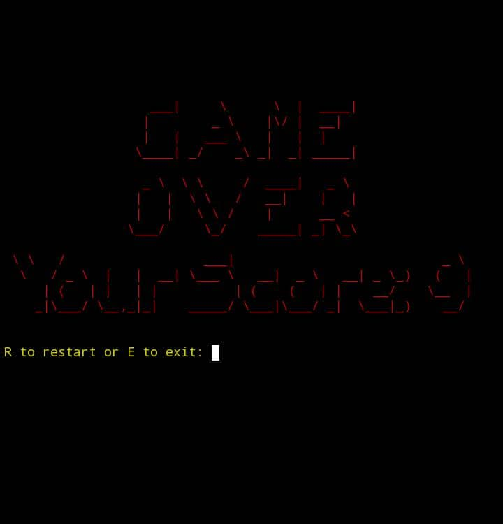
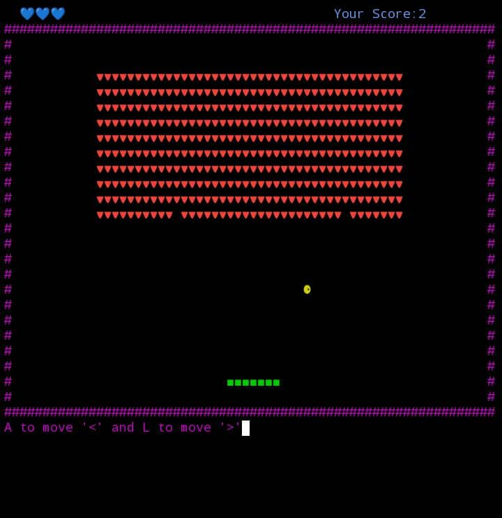
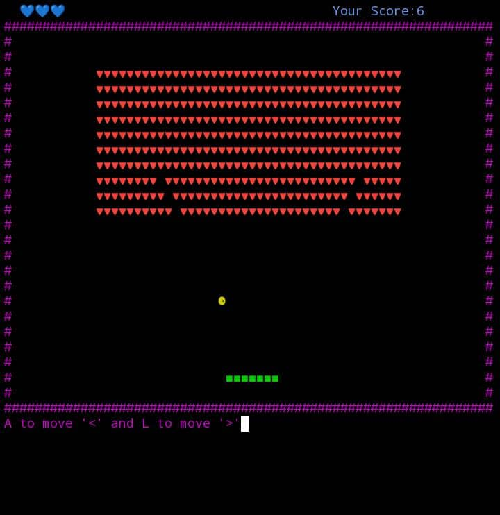

## Preview

<div style="display: flex; gap: 60px;">
  
  
  
</div>

# BrickGame

**BrickGame** is a classic brick breaker arcade game implemented in Java for the command-line interface (CLI). It features colorful ASCII graphics, responsive real-time controls, score and life tracking, and adapts automatically to your terminal size. The game is ideal for running in terminal environments like Termux on Android, Linux, or macOS.

---

## Features

- **Classic Arcade Gameplay:** Break all the bricks by bouncing the ball with your paddle.
- **Real-Time Controls:** Fast and responsive paddle movement with keyboard input.
- **Dynamic Terminal Sizing:** Game display adjusts automatically to your terminal window size.
- **Score and Lives Display:** Track your current score and remaining lives at all times.
- **Colorful ASCII Art:** Enhanced visuals for a more engaging experience.
- **Game Over Banner:** Stylish "Game Over" screen using `figlet` (if installed).
- **Easy to Run:** All dependencies, including `jline`, are included in this repository.

---

## Requirements

- **Java 8 or higher**
- **Terminal emulator** (Termux, Linux, or macOS terminal recommended)
- **figlet** (optional, for enhanced "Game Over" display)
  - Install via `pkg install figlet` (Termux) or `sudo apt install figlet` (Linux)

---

## Getting Started

### 1. Clone the Repository

```sh
git clone https://github.com/yourusername/BrickGame.git
cd BrickGame
```

### 2. Run the Game

```sh
java -cp ../jline-3.30.0.jar BrickGame.java
```

---

## Controls

| Key        | Action                              |
|------------|-------------------------------------|
| `A` or `a` | Move paddle left                    |
| `L` or `l` | Move paddle right                   |
| `P` or `p` | Pause or resume the game            |
| `R` or `r` | Restart the game (after game over)  |
| `E` or `e` | Exit the game                       |

---

## How to Play

- The goal is to break all the bricks by bouncing the ball off your paddle.
- You have 3 lives. If you miss the ball, you lose a life.
- Your score increases for each brick you break.
- The game ends when you lose all your lives.
- After game over, you can restart (`R`) or exit (`E`).

---

## Customization

- **Brick Board Size:** Edit the numbers in `initBricks(int y, int x)` in `BrickGame.java` to change the brick layout.
- **Paddle Size:** Modify the `padLen` variable for a longer or shorter paddle.
- **Difficulty:** Adjust the `repeat`, `speedX`, or `speedY` variables to make the game faster or slower.

---

## Troubleshooting

- **No input or display issues:** Ensure you’re using a compatible terminal and have the correct `jline` JAR in the directory.
- **No Game Over banner:** Install `figlet` for a better "Game Over" display.
- **Display glitches:** Maximize your terminal or restart the game after resizing.

---

## Code Structure

- `BrickGame` — Main class containing game logic, rendering, and state management.
- `ReadInput` — Handles real-time keyboard input using JLine 3.

---

## Contributing

Contributions are welcome! Please fork the repository and submit a pull request for bug fixes, improvements, or new features.

1. Fork this repository.
2. Create a branch: \`git checkout -b feature/your-feature\`
3. Commit your changes.
4. Push to your fork: \`git push origin feature/your-feature\`
5. Open a pull request.

---

## License

This project is licensed under the MIT License.

---

## Acknowledgments

- [JLine](https://github.com/jline/jline3) for advanced terminal input handling.
- [figlet](http://www.figlet.org/) for ASCII art banners.
- The open source community for inspiration.

---

**Enjoy BrickGame in your terminal! If you have suggestions or issues, feel free to open an issue or pull request.**
