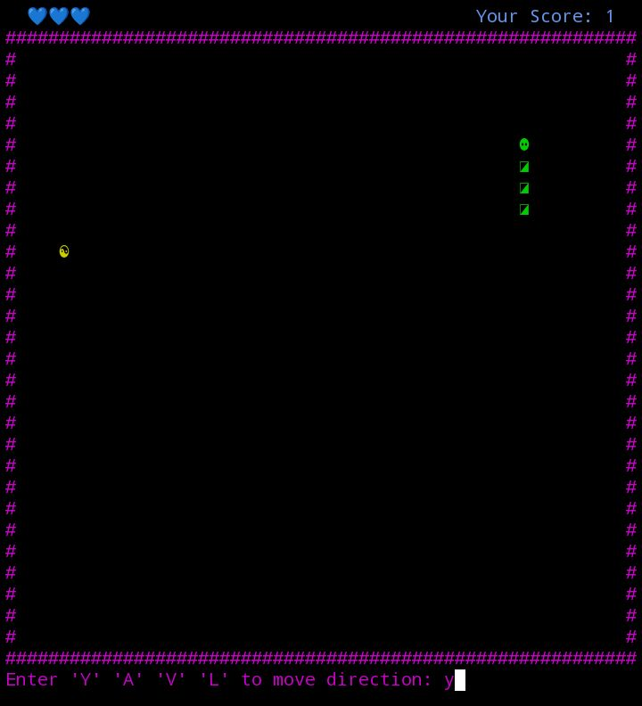

# Preview 

<div style="display: flex; gap: 60px;">
    
    
    
    
</div>

# SnakeGame

A classic Snake game playable directly in your terminal!  
This Java-based console game features colored graphics, keyboard controls, adjustable speed, multiple lives, and a fun retro feel.  
Built with [JLine](https://github.com/jline/jline3) for smooth keyboard input and terminal rendering.

## Features

- **Terminal UI:** Play using colored Unicode characters in your terminal.
- **Keyboard Controls:** Move the snake using `Y` (up), `A` (left), `V` (down), `L` (right).
- **Pause and Restart:** Press `P` to pause, `R` to restart at any time.
- **Score Tracking:** Earn points by eating food and see your score in real-time.
- **Lives System:** You get 3 lives – hit the wall or yourself, and you lose a life.
- **Speed Increase:** The game gets faster as your score goes up.
- **Game Over Animation:** Enjoy a retro "GAME OVER" display rendered with `figlet`.

## Requirements

- Java 11 or later
- [JLine 3](https://github.com/jline/jline3) library (add to your classpath)
- Unix-like terminal (Linux, macOS, or Windows Subsystem for Linux)
- `figlet` installed (for fancy game over screen)

## How to Play

1. **Clone the repository**
   ```sh
   git clone https://github.com/James-Kwao/consoleGames.git
   cd consoleGames/SnakeGame
   ```

2. **Compile the code**
   ```sh
   javac -cp ../jline-terminal-3.30.0.jar SnakeGame.java
   ```

3. **Run the game**
   ```sh
   java -cp ../jline-terminal-3.30.0.jar SnakeGame
   ```

4. **Controls**
   - `Y` or `y` - Move Up
   - `A` or `a` - Move Left
   - `L` or `l` - Move Right
   - `V` or `v` - Move Down
   - `P` - Pause/Unpause
   - `R` - Restart
   - `Q` - Quit

## Notes

- For Windows users: Running this game is best on WSL or a compatible terminal emulator.

---                                                                   
## Acknowledgments

- [JLine](https://github.com/jline/jline3) for advanced terminal input
 handling.
- [figlet](http://www.figlet.org/) for ASCII art banners.
- The open source community for inspiration.

---
## Example Screenshot

```
💙💙💙                         Your Score: 4
#############################################
#                                           #
#              🐍    ⚡                     #
#                                           #
#############################################
Enter 'Y' 'A' 'V' 'L' to move direction: l
```

## License

MIT License. See [LICENSE](../LICENSE) for details.

---

**Enjoy playing Snake in your terminal!**
